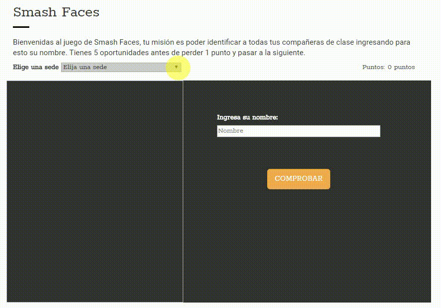

# smash-faces

- El proyecto consiste en realizar un juego que ayuda a memorizar el nombre de tus compañeras de clase.

## Fuentes consultadas:
- jQuery: url(http://api.jquery.com/)

### app1.js
Aquí desarrollaremos el código usando la líbreria de js (jQuery); en el cual tendremos una función inicial que se ejecutará al estar cargado el documento.
Tenemos un select para elegir la sede(la cual puede ser un switch o un if); después tendremos condicionales si es que acierta sumarle 5 puntos, si es que falla 5 veces perderá un punto,
y se le mostrará una nueva foto.

## Versión Desktop 
Así se ve en la versión desktop:  

## Desarrollado con:

`HTML` `JavaScript` `CSS` `JQUERY`  

##  Créditos* 
* [Stephanie Hiyagon](https://github.com/stephHiyagon)
